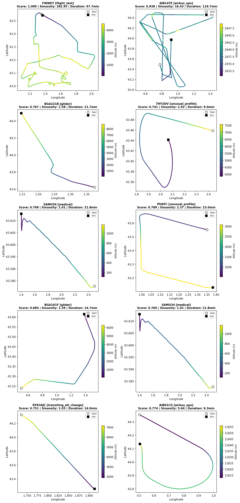

# ADS-B Behavioral Anomaly Detection: Study case Toulouse TMA

> Track-based anomaly detection methodology using ADS-B data over the Toulouse Terminal Maneuvering Area.  
> Designed as a sensor-agnostic framework applicable to AIS maritime tracks or radar-derived data with minimal adaptation.

---

## Motivation

Air traffic surveillance generates continuous streams of positional data that must be screened for non-standard behavior. This project demonstrates a small but complete anomaly detection pipeline: from raw ADS-B ingestion to classified anomaly taxonomy. I am using publicly available data over one of Europe's most operationally significant airspaces: Toulouse-Blagnac (LFBO), home to Airbus headquarters and a dense mix of commercial, military, and experimental traffic.

The methodology prioritizes **explainability and transferability** over model complexity. Every analytical decision has been justified from the data, and the pipeline has been designed to generalize to other sensor types and geographic areas.

---

## Results Overview

The combined detector (Isolation Forest + DBSCAN) flagged **31 anomalous tracks** out of 1,546 (2.0%), independently discovering five operationally distinct anomaly categories without labeled training data:

| Category | Count | Example | Why anomalous |
|---|---|---|---|
| Flight test | 1 | FWWEY (Airbus) | Sinuosity 282 — complex maneuver profile |
| Airbus operations | 12 | AIB14TE | Novel trajectory shape, high heading change rate |
| Gliders | 2 | BGA221B | Unusual altitude profile, no engine signature |
| Medical helicopters | 1 | SAMU34 | Low altitude, short duration, no flight plan |
| Unusual profiles | 3 | THY2DV, PHATC | Significant heading changes, unexpected altitude |



---

## Methodology Overview

```
Raw ADS-B          OPDI Flight List      State Vector
State Vectors   +  (Eurocontrol)      +  Snapshots
      │                  │                    │
      └──────────────────┴────────────────────┘
                         │
                 Phase 1: Data Foundation
                 (37,735 flights, 12 months)
                         │
                 Phase 2: Track Reconstruction
                 (gap detection, interpolation,
                  altitude spike removal)
                         │
                 Phase 3: Baseline EDA
                 (corridor extraction via DBSCAN,
                  altitude profiles, heatmaps)
                         │
                 Phase 4: Feature Engineering
                 (20 behavioral features per track:
                  geometric, altitude, kinematic,
                  contextual)
                         │
                 Phase 5: Anomaly Detection
                 (Isolation Forest + DBSCAN
                  combined score)
                         │
                 Phase 6: Anomaly Characterization
                 (taxonomy, manual inspection,
                  operational interpretation)
```

---

## Data Sources

| Source | Coverage | Access |
|---|---|
| OPDI Flight List (Eurocontrol) | Jan–Dec 2024, LFBO arrivals
| OPDI Flight Events (Eurocontrol) | 4D milestones per flight
| OpenSky State Vectors | 3 Mondays (2017–2018), peak hours

**Note on state vectors:** The OpenSky public dataset provides state vector snapshots for Mondays only (up to 2018). This project deliberately samples peak Monday traffic, the busiest day at LFBO confirmed by EDA,maximising corridor coverage. Current data is available via OpenSky Trino (researcher access required).

---

## Anomaly Detection Design
### Why Isolation Forest + DBSCAN?

Two independent signals are combined because they capture different aspects of anomaly:

- **DBSCAN** operates on trajectory shape (10-waypoint spatial representation). Tracks that don't fit any known corridor (label = -1) are spatial outliers.
- **Isolation Forest** operates on behavioral features (altitude profile, speed variance, heading change rate, sinuosity). It identifies tracks that are unusual across multiple dimensions simultaneously.

A track that is anomalous on both signals is a much stronger candidate than either alone.

### Contamination parameter justification

`contamination=0.015` was derived from Phase 1 EDA: duration outlier analysis (p01/p99) identified 1.5% of flights as statistically extreme. This data-driven calibration avoids the common mistake of using an arbitrary contamination value.

### Combined score

```python
anomaly_score = 0.7 * iforest_score_norm + 0.3 * dbscan_score_norm
```

Isolation Forest carries higher weight (0.7) because it uses all 20 behavioral features vs DBSCAN which only uses trajectory shape.

---

## Feature Engineering

20 features computed per track, grouped into four categories:

**Geometric** — `track_length_km`, `straight_line_km`, `sinuosity`, `min_dist_to_lfbo_km`, `lateral_deviation_deg`

**Altitude** — `alt_mean_m`, `alt_max_m`, `alt_min_m`, `alt_range_m`, `alt_std_m`, `alt_net_change_m`, `alt_slope`

**Kinematic** — `speed_mean_ms`, `speed_std_ms`, `speed_min_ms`, `speed_max_ms`, `speed_cv`, `heading_change_rate`

**Contextual** — `duration_min`, `point_count`

Key finding from feature inspection: sinuosity alone identified FWWEY (Airbus flight test, sinuosity=282) before any model was run — demonstrating that well-engineered features surface anomalies even without ML.

---

## Repository Structure

```
├── README.md
├── requirements.txt
├── docker-compose.yml
├── .gitignore
├── 01_data_foundation.ipynb             # OPDI download, EDA, enrichment
├── 02_track_reconstruction.ipynb        # State vector ingestion, track building
├── 03_baseline_eda.ipynb                # Heatmaps, altitude profiles, DBSCAN corridors
├── 04_feature_engineering.ipynb         # Feature computation, scaling, inspection
└── 05_anomaly_detection.ipynb           # Model, scoring, taxonomy, visualization
├── src/
│   ├── __init__.py
│   ├── track_reconstruction.py          # TrackSegment, gap splitting, interpolation
│   └── features.py                      # compute_features(), haversine()
└── figures/
    ├── heatmap_layered.html             # Interactive traffic density by category
    ├── corridors_all.html               # DBSCAN corridor map (27 corridors)
    ├── altitude_profiles.png            # Altitude distributions by category
    ├── altitude_over_time.png           # Altitude profiles over track duration
    ├── anomaly_fwwey.html               # Airbus flight test track
    ├── anomalies_classified.html        # All anomalies, categorized, interactive
    └── anomaly_sample_gradient.png      # Sample trajectory + altitude gradient
```

---

## How to Run
### Prerequisites

```bash
git clone https://github.com/GaelCarniel/ADS-B_Anomaly_Detection
cd ADS-B_Anomaly_Detection
pip install -r requirements.txt
```

### Run with Docker

```bash
docker-compose up
```

Then open `http://localhost:8888` in your browser.

### Run locally

```bash
jupyter notebook notebooks/01_data_foundation.ipynb
```

Run notebooks in order (01 → 05). Each notebook saves its outputs to `data/processed/` for the next stage.

**Data download is automatic** — notebooks fetch OPDI and OpenSky data on first run and cache locally. Expect ~2GB disk usage and ~30 minutes for full pipeline execution.

---

## Generalizability

This methodology was designed to be sensor-agnostic. Adapting to other data sources requires:

| Component | ADS-B | AIS Maritime | Radar |
|---|---|---|---|
| Ingestion | OpenSky API / Trino | MarineTraffic / AISHub | Proprietary |
| Track reconstruction | Identical | Identical | Identical |
| Features | Direct reuse | Direct reuse (SOG/COG replace speed/heading) | Partial reuse |
| Corridor baseline | Identical | Identical | Identical |
| Anomaly model | Identical | Identical | Identical |

The core pipeline — reconstruct tracks, extract corridors, engineer behavioral features, score with Isolation Forest + DBSCAN — transfers directly.

---

## Limitations and Future Work

- **State vector temporal coverage:** Public OpenSky snapshots are Monday-only and capped at 2018. Current data requires Trino researcher access (application pending). The methodology is validated; the data pipeline would be unchanged with current data.
- **Classification accuracy:** Arriving/departing/transiting classification uses spatial + altitude thresholds. Some genuine arrivals are misclassified as transiting when the bbox boundary cuts the track before final approach. Ground truth from OPDI flight list (ADES=LFBO) would improve this.
- **Feature scope:** Transponder gap count and squawk code analysis were identified as high-value features but not implemented in this version. Both are available in the raw state vector data.

---

## Tech Stack

`Python` · `pandas` · `geopandas` · `scikit-learn` · `folium` · `matplotlib` · `pyopensky` · `Docker`
